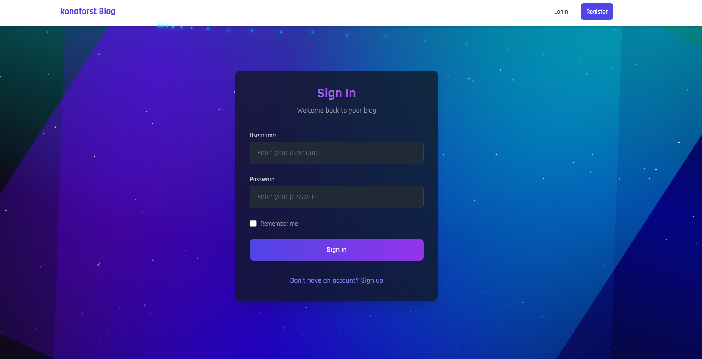
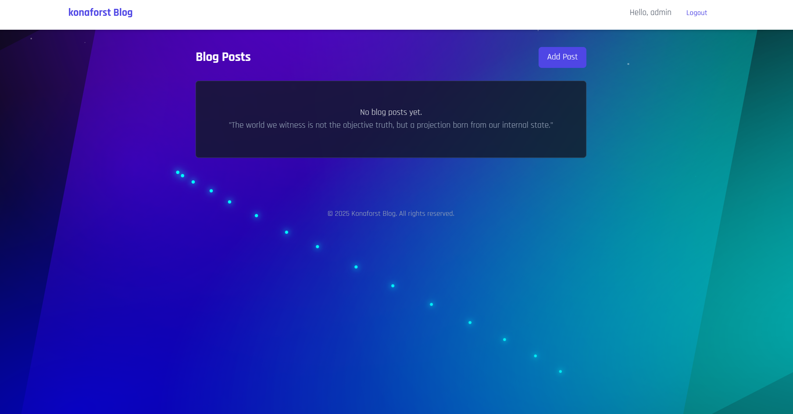

# 🌌 Frost Byte

   

## ✨ 项目介绍

欢迎来到 **Frost Byte** - 一个充满科幻感的全栈博客系统！🚀

这不仅仅是一个普通的博客，而是一个沉浸式的数字体验空间。当你打开这个博客时，你会被绚丽的极光背景、飘落的雪花和跟随鼠标的光迹所包围，仿佛置身于一个未来世界的数字图书馆。


### 🎨 主要特色

- 🌈 **极光背景效果** - 动态渐变的极光背景，营造梦幻氛围
- ❄️ **雪花飘落动画** - 细腻的粒子效果，增添冬日诗意
- ✨ **光标轨迹特效** - 跟随鼠标的炫酷光迹效果
- 📝 **现代化编辑器** - 流畅的博客创作和阅读体验
- 🔐 **用户认证系统** - 安全的登录注册功能
- 📱 **响应式设计** - 完美适配各种设备

## 🖼️ 界面展示

### 登录界面

*欢迎来到赛博朋克风格的登录界面！在这里，你将踏入一个充满未来感的数字世界。极光般的背景色彩流转，仿佛置身于星际空间站的控制台前。输入你的凭证，开启这场奇妙的博客之旅吧！✨*

### 主页界面

*这就是你的专属数字领域！当还没有任何文章时，系统会用一句富有哲理的话语迎接你："我们所见证的世界并非客观真理，而是源自我们内在状态的投影。" 点击右上角的"Add Post"按钮，开始创造属于你的数字传奇！背景中飘洒的粒子效果让整个界面充满了生命力。🌌*

### 🛠️ 技术栈

**前端：**
- React 19.1.1 + TypeScript
- Vite 构建工具
- Tailwind CSS 样式框架
- React Router 路由管理

**后端：**
- Django 5.2.4 REST Framework
- MySQL 数据库
- Token 认证
- CORS 跨域支持

## 🚀 快速开始

### 环境要求
- Node.js 16+
- Python 3.8+
- MySQL 5.7+

### 安装步骤

1. **克隆项目**
```bash
git clone https://github.com/yourusername/frost-byte.git
cd frost-byte
```

2. **前端设置**
```bash
npm install
npm run dev
```

3. **后端设置**
```bash
cd backend
pip install -r ../requirements.txt
python manage.py migrate
python manage.py runserver
```

4. **数据库配置**
- 创建 MySQL 数据库 `blog_db`
- 修改 `backend/settings.py` 中的数据库配置

### 🎯 使用说明

- 访问 `http://localhost:5173` 查看前端界面
- 点击 "New Post" 创建新博客文章
- 注册账户后即可发布和管理自己的文章
- 享受沉浸式的视觉体验！

## 🙏 致谢

特别感谢 **Trae** 这个强大的IDE！🎉 让这个项目能够快速从想法变为现实。Trae 不仅提升了开发效率，更让编程变成了一种享受。

---

⭐ 如果你喜欢这个项目，请给它一个 Star！

📧 有任何问题或建议，欢迎提交 Issue 或 Pull Request。

🌟 让我们一起在数字世界中创造更多美好的体验！
